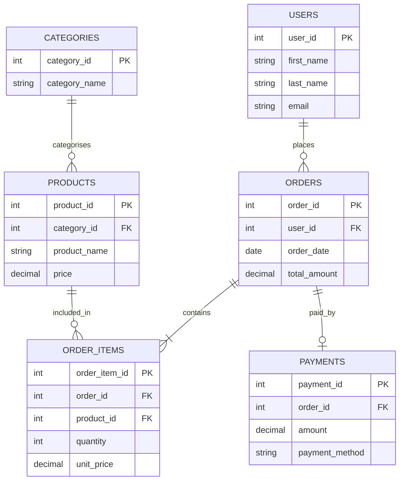
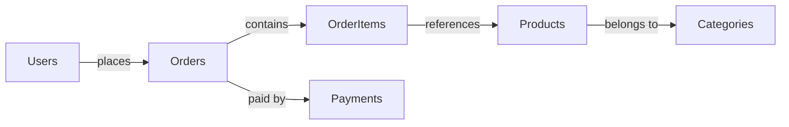

# Chapter 3: Joins

## Overview

## What Joins Are

Joins let SQL queries combine related rows from two or more tables. Instead of storing every piece of information in one large table, relational databases split data into focused tables and connect them with keys.

In this cookbook, orders belong to users, products belong to categories, order items connect orders to products, and payments belong to orders. Joins let you answer business questions across those relationships.

## Key Concepts

- **Primary Keys** uniquely identify rows in a table, such as `users.id` or `orders.id`.
- **Foreign Keys** store references to rows in another table, such as `orders.user_id`.
- **INNER JOIN** returns only rows that match in both joined tables.
- **LEFT JOIN** keeps every row from the left table and adds matching rows from the right table.
- **RIGHT JOIN** keeps every row from the right table and adds matching rows from the left table.
- **FULL OUTER JOIN** keeps rows from both tables, matched where possible.
- **CROSS JOIN** returns every combination of rows from both inputs.
- **SELF JOIN** joins a table to itself using aliases.

## Why Joins Exist

Joins exist because well-designed databases avoid unnecessary duplication. For example, an order stores `user_id` instead of copying a customer's name and email into every order row. A join can retrieve the customer details only when a query needs them.

## ER Diagram



Tip: understand the table relationships first; the join examples are much easier to follow when you can see which keys connect each table.



## Visual Explanation of Each Join

```text
INNER JOIN
Only rows that match in both tables.

LEFT JOIN
All rows from the left table, plus matching rows from the right table.

RIGHT JOIN
All rows from the right table, plus matching rows from the left table.

FULL OUTER JOIN
All rows from both tables, matched where possible.

CROSS JOIN
Every row from one input combined with every row from another input.

SELF JOIN
A table joined to itself, usually with two aliases.
```

## When to Use Each Join

- Use `INNER JOIN` when both sides must exist, such as orders with their customers.
- Use `LEFT JOIN` when the primary table should remain visible even without a match.
- Use `RIGHT JOIN` rarely; it can usually be rewritten as a clearer `LEFT JOIN`.
- Use `FULL OUTER JOIN` when auditing or comparing two sets where unmatched rows matter.
- Use `CROSS JOIN` when you intentionally need every combination, such as a reporting grid.
- Use `SELF JOIN` when rows in the same table need to be compared with each other.

## Performance Considerations

- Join on indexed key columns where possible.
- Always include an `ON` condition unless you intentionally want a `CROSS JOIN`.
- Select only the columns needed by the report or application.
- Watch for duplicate rows when joining one-to-many relationships.
- Use aggregation carefully after joins because each joined row can affect totals.
- Check query plans with `EXPLAIN` when joins become slow.

## Common Beginner Mistakes

- Forgetting the `ON` clause and accidentally creating a large result set.
- Joining on columns with similar names but different meanings.
- Expecting `LEFT JOIN` filters in `WHERE` to preserve unmatched rows.
- Using `SELECT *` after joining tables with overlapping column names.
- Aggregating after a join without understanding row multiplication.
- Using `RIGHT JOIN` when swapping table order and using `LEFT JOIN` would be clearer.

## Recommended Learning Order

1. [INNER JOIN](01_inner_join.sql)
2. [LEFT JOIN](02_left_join.sql)
3. [RIGHT JOIN](03_right_join.sql)
4. [FULL OUTER JOIN](04_full_outer_join.sql)
5. [CROSS JOIN](05_cross_join.sql)
6. [SELF JOIN](06_self_join.sql)
7. [Join multiple tables](07_join_multiple_tables.sql)
8. [Join with aggregation](08_join_with_aggregation.sql)
9. [Join and filter](09_join_and_filter.sql)
10. [Join best practices](10_join_best_practices.sql)
11. [Common join mistakes](11_common_join_mistakes.sql)
12. [Real-world reporting](12_real_world_reporting.sql)

## Learning Outcomes

After completing this chapter, you should be able to:

- Explain how primary keys and foreign keys connect related tables.
- Choose the right join type for common reporting questions.
- Join users, orders, products, payments, and categories in practical queries.
- Recognise and avoid accidental row multiplication.
- Combine joins with filters, sorting, and aggregation.
- Read joined query results with clear column aliases.

## Difficulty

Intermediate

## Estimated Completion Time

2–3 Hours

## Related Chapters

- [Chapter 2: Filtering & Sorting](../02_filtering_sorting/README.md)
- [Chapter 4: Aggregation](../04_aggregates/)
